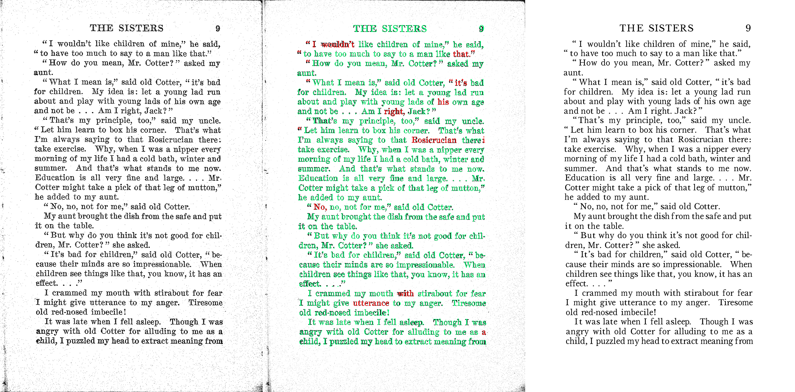

# Scribe OCR
Web interface for proofreading OCR and creating fully-digitized documents. 

# Overview

Scribe OCR is a free and open-source interface for visualizing and editing OCR results.  By precisely overlaying OCR text over source images, it allows for easy proofreading and the creation of fully digitized versions of print documents. 

For example, three versions of a scanned book page found at [Archive.org](https://archive.org/details/in.ernet.dli.2015.350580/page/n17/mode/2up) are shown below.  The first panel shows the original image.  The second shows Scribe OCR’s Proofreading Mode, which precisely layers colored OCR text over the source image.  In addition to overlapping poorly with the underlying image, most errors are also colored red, which indicates the OCR engine flagged them as low-confidence.  The third panel shows Ebook Mode, which only contains the (now corrected) text layer.  

Most OCR output formats either compromise on faithfully representing the original document (e.g. text or markdown that omits formatting) or produce enormous files by printing invisible text over the original scanned images.  In contrast, the third panel above (Ebook Mode) is extremely close to the original scan while maintaining a small file size.  (Note that exporting .pdfs with the traditional invisible text-over-image approach is also supported.)  
